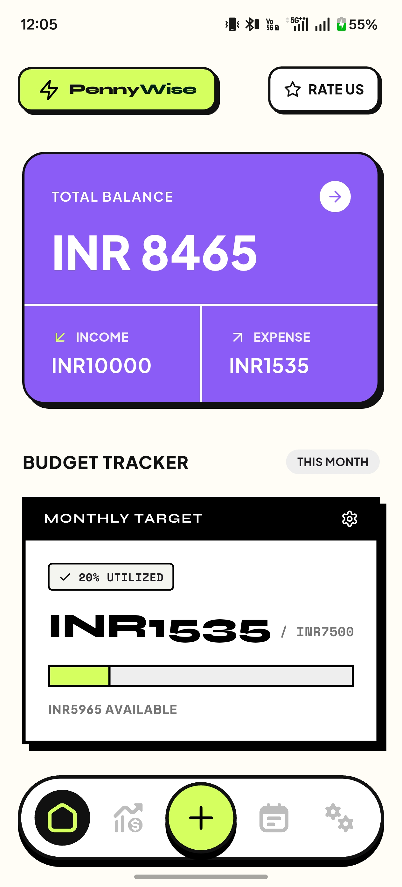
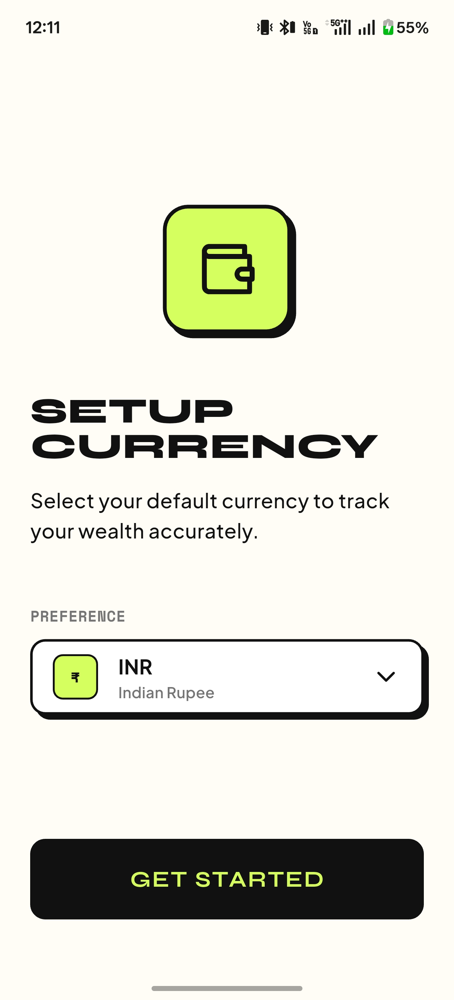
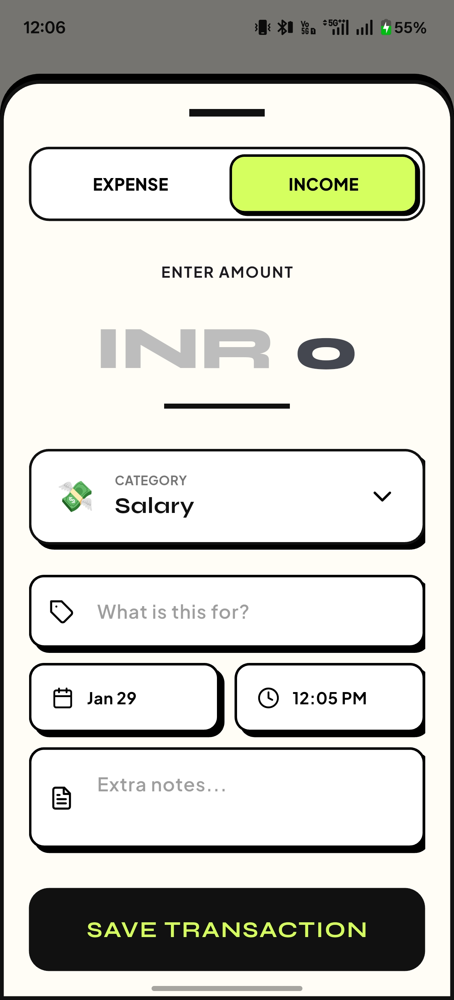
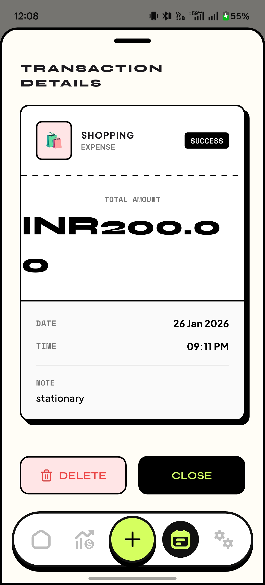
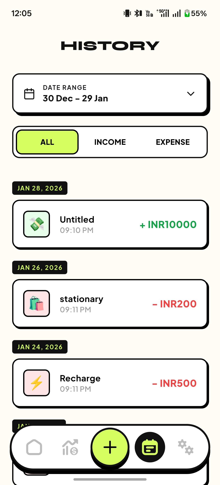
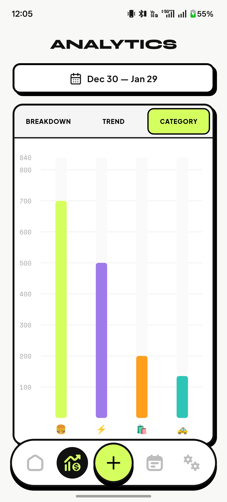
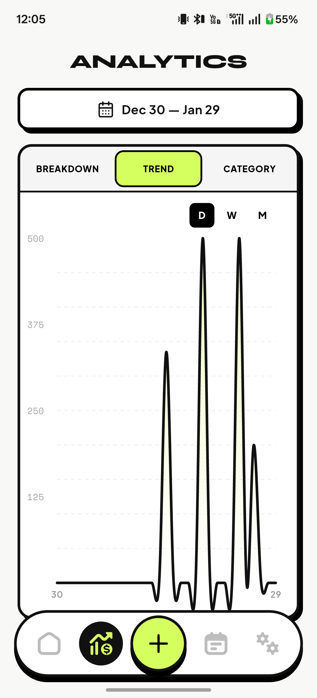
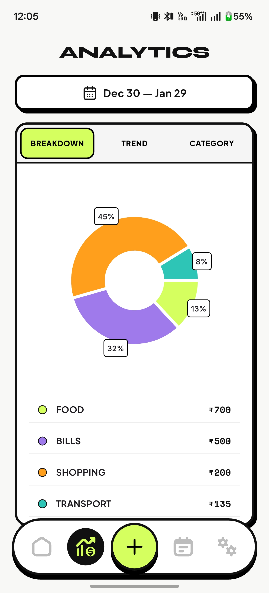

# PennyWise - Offline Expense Tracker

PennyWise is a **minimal, offline expense tracking app** built using **Flutter**.  
It helps users track income and expenses locally, visualize spending patterns, and stay in control of their money **without accounts, ads, or cloud dependency**.

This project was built as a **learning + real-world product** to explore Flutter app architecture, local databases, and thoughtful UI design, while still being genuinely useful for everyday users.

  

---

## ✨ Design Philosophy

PennyWise follows a **neo-brutalist UI style**:

- Bold borders and sharp contrast  
- Intentional use of color  
- Minimal gradients, no visual noise  
- Clear hierarchy and readable data  

---

## 🚀 Features

- **Offline-first expense tracking**  
  All expenses and income are stored locally on the device. The app works fully offline and does not require an internet connection.

- **Income & expense management**  
  Easily add, edit, and manage transactions with a clear distinction between income and expenses.

- **Category-based analytics**  
  Visualize where your money goes using bar charts, pie charts, and spending trends.

- **Neo-styled dashboard**  
  A clean and focused dashboard that highlights total balance, recent activity, and spending direction at a glance.

- **Budget tracking**  
  Set spending limits and monitor progress to stay within budget and control monthly expenses.

- **Flexible date range filtering**  
  Analyze spending over custom time ranges such as daily, weekly, or monthly periods.

- **Transaction history & details**  
  Browse past transactions and view detailed information for each entry.

- **Multi-currency support**  
  Choose from **10 different currencies** during initial setup to match your region and preference.

---

## 🛠 Tech Stack

- **Flutter**
- **Dart**
- **Riverpod** – State management
- **Drift (SQLite)** – Local database
- **fl_chart** – Data visualization
- **GoRouter** – Navigation & routing
- **Material 3**

---

## 📸 Screenshots

### Core Screens

| Splash | Dashboard | Currency Setup |
|------|-----------|----------------|
|  |  |  |

---

### Transactions

| Add Transaction | Transaction Detail | History |
|-----------------|-------------------|---------|
|  |  |  |

---

### Analytics

| Bar Chart | Line Graph | Pie Chart |
|----------|------------|-----------|
|  |  |  |

---

## 🔐 Privacy

PennyWise respects user privacy by design.  
The app does not collect, store, or share any personal data. All information remains locally on the user’s device.

